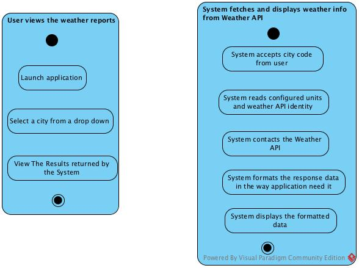
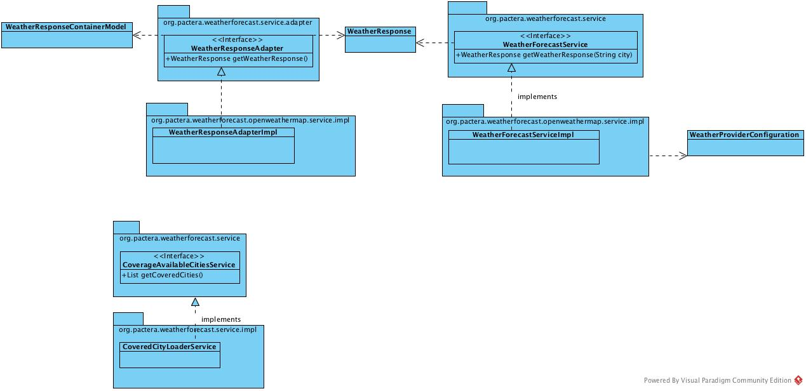

# Weather Forecast Reporting Application (WeFoRA)
This is a weather forecast reporting application for selected cities. More cities could be added in a configurable way.

------------------------------------
Architecture Stack
------------------------------------
Front end: HTML, AngularJS, CSS, 
Back end: Spring Boot 1.3.2, Spring MVC 4,
Unit test: JUnit 4, Mockito
Build Tool : Maven

---------------------------------
Development Environment
------------------------------------
Mac OSX 10.11.3
STS 3.7.2
JDK 8

------------------------------------
System Requirement:
------------------------------------
JDK 1.8+  
MAVEN 3.3.9
Application tested on Mac OSX 10.11.3  


------------------------------------
Architectural Overview
------------------------------------

The application follows three-tire architecture:

* client side: including html pages and javascript files
* web tier: Restful controllers
* service tier: CityLoading Service and WeatherForeCasting service

Current implementation make use of a free service provided by Open Weather Map(http://openweathermap.org) for weather updates. But this could easily be replaced with another
implementation since the respective services are designed in a loosely coupled fashion.

Unit tests covers critical code regions.

Spring boot is used for quick turn around and to avail of an embedded tomcat deployment.

------------------------------------
Design Diagrams
------------------------------------
Activity Diagrams - For User and System


Class Diagram - Around Service Classes



------------------------------------
To build and run the tests
------------------------------------
```
mvn clean compile test
```
------------------------------------
To run this application:
------------------------------------
```
mvn spring-boot:run
```
------------------------------------
To access the application:
------------------------------------
http://localhost:8080/

-------------------------
Configuration Options
-------------------------
More cities could be added by specifying it as a comma separated value for the property "weather.cities" in application.properties. This requires a restart of the server.
