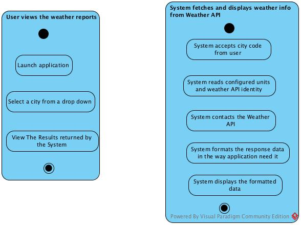
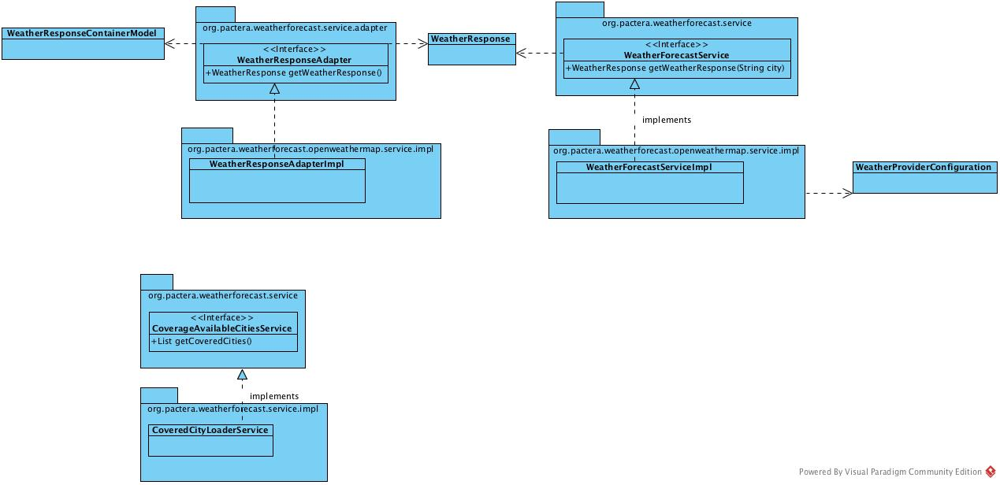

# Weather Forecaster (WeFor)
This is a weather forecast reporting application for selected cities. More cities could be added in a configurable way.

This was a project done as needed by employment recruitment process in 2016. However, it was a good opportunity to pick up Spring Boot.

Architecture Stack
------------------------------------
* Front-end: HTML, AngularJS, CSS
* Back-end: Spring Boot 1.3.2, JDK 8
* Dev Env Support: Spring-Boot embedded Tomcat 
* Test Automation: JUnit 4, Mockito, Jacoco, Sonar, Docker(from https://github.com/mechero/code-quality-game)
* Build & Package : Maven
* SCM : GitHub

Development Environment
------------------------------------
* Mac OSX 10.11.3
* STS 3.7.2
* JDK 8
* Visual Paradigm Community Edition UML Tool

System Requirement:
------------------------------------
* JDK 1.8+  
* MAVEN 3.3.9
* Application tested on Mac OSX 10.11.3  

Architectural Overview
------------------------------------

The application follows three-tire architecture:

* client side: HTML page and AngularJS-based JavaScript file
* web tier: Restful controllers to collaborate between views and services
* service tier: Spring annotated services for loading the covered cities and for fetching the weather data for the selected city

Current implementation make use of a free service provided by Open Weather Map(http://openweathermap.org) for weather updates. But this could easily be replaced with another
implementation since the respective services are designed in a loosely coupled fashion.

Unit tests covers the core code regions.

Spring-Boot is used for quick turn around and to avail of an embedded Tomcat deployment.

Design Diagrams
------------------------------------
Activity Diagrams - For User and System


Class Diagram - Around Service Classes


To run the tests
------------------------------------
```
mvn clean compile test
```

To take the test coverage
------------------------------------
To instantiate a sonar instance

```
docker-compose -f docker-compose-sonar.yml up
```
To send test results to sonar instance

```
mvn sonar:sonar
```
To view the test coverage

```
http://localhost:9000/dashboard?id=com.recruitment%3Aweatherforecast
```

To run this application:
------------------------------------
```
mvn spring-boot:run
```

To access the application:
------------------------------------
http://localhost:8080/

To Build WAR :
------------------------------------
mvn package

Configuration Options
-------------------------
More cities could be added by specifying it as a comma separated value for the property "weather.cities" in application.properties. This requires a restart of the server.
